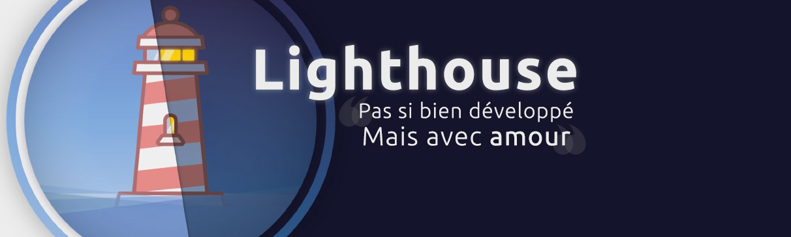

# [LightHouse in Canvas](https://svnth.fr/lab/lighthouse)
Une **première expérimentation** du canvas, par Julien BRETECHER

## Commandes & features
* Appuyer sur **espace** switch le cycle jour/nuit 
* Appuyer sur **T** permet d'allumer/d'éteindre les phares 
* Appuyer sur **S** la nuit fait tomber de la neige 

## Technologies employées
* HTML, CSS, Javascript
* Canvas
* [HiDPI](https://github.com/jondavidjohn/hidpi-canvas-polyfill), support des hautes résolutions

## Remarques
> * Rendu pour HÉTIC, le 10 décembre 2017
> * Ne pas hésiter à désactiver HiDPI en cas de problèmes de performances
> * Le blur en canvas, plus jamais. (Tout comme créer une telle scène. svg ftw)
> * À propos de l'utilisation de deux canvas au lieu d'un, même si non recommandés *(problème d'optimisations ?)* : je ne voyais pas d'autres solutions propres concernant les dégradés 
> * [All I Want For Christman - Maxenss](https://www.youtube.com/watch?v=PQvYQxDu8hs)  (désolé)